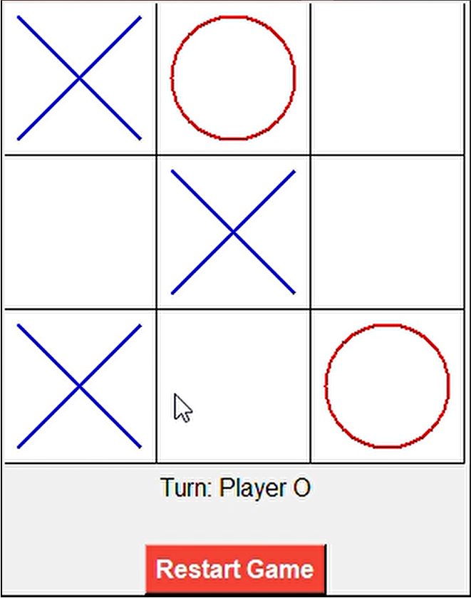
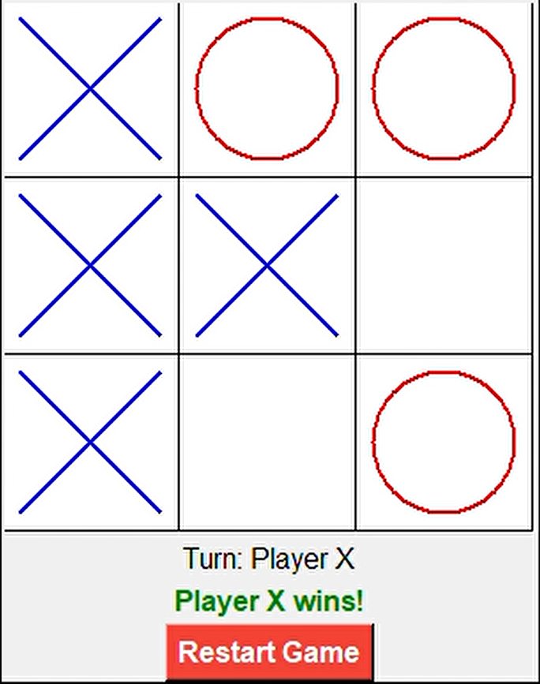
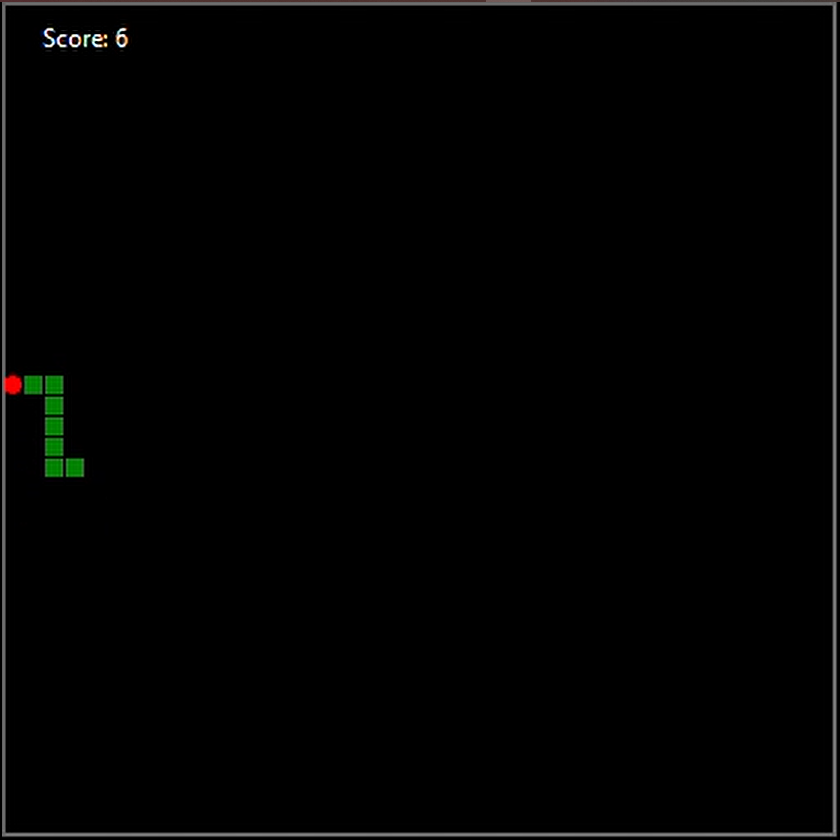
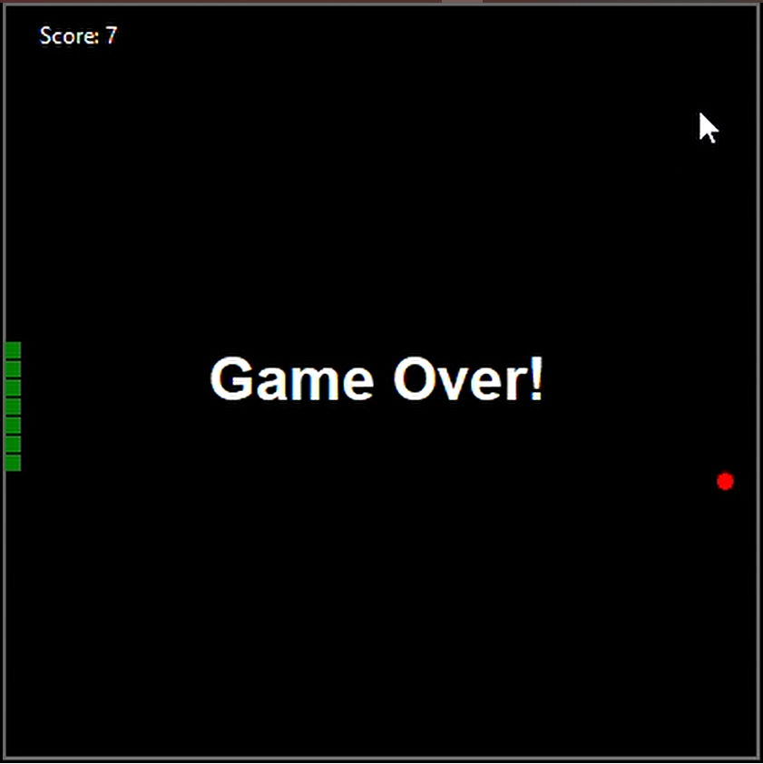
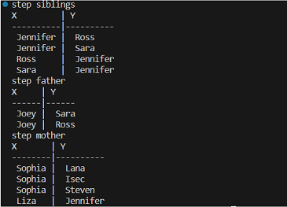

# Python Language Course Repository

Welcome to my Python Language Course repository! This repository contains materials from a free, voluntary Python course that was organized and taught at information technology engineering, damascus university. The aim of this course was to provide a comprehensive introduction to Python programming, covering fundamental concepts and progressing to more advanced topics, including an introduction to artificial intelligence.

## Purpose

The primary goal of this repository is to serve as a resource for students and self-learners who wish to learn Python programming from scratch or enhance their existing knowledge. Each chapter in this course is designed to build on the previous ones, ensuring a smooth and logical progression through the various aspects of Python programming.

The curriculum is designed to be comprehensive and engaging, featuring various exercises that illustrate advanced concepts and reinforce each chapter's goals. Exercises include a "Guess the Number" game, an employee list CRUD application, a "Worm" game, a multi-player Tic-Tac-Toe game, and, in the AI introduction chapter, a family relationship recognition program using First-order logic. These practical projects ensure learners gain hands-on experience with Python's diverse capabilities.

## Curriculum Overview

The course is divided into six main chapters, each focusing on different aspects of Python programming:

1. **Basic Settings**: 
    - Topics: Data types, loops, control commands, conditions.
    - Objective: Introduce the fundamental building blocks of Python programming.
    
2. **Functions**: 
    - Topics: Defining and calling functions, arguments, return values, scope.
    - Objective: Teach how to create and use functions to organize and reuse code effectively.
    
3. **Data Structures**: 
    - Topics: Lists, tuples, dictionaries, sets.
    - Objective: Understand and utilize different data structures effectively.
    
4. **Object-Oriented Programming (OOP)**: 
    - Topics: Classes, objects, inheritance, polymorphism.
    - Objective: Provide a solid foundation in OOP principles and practices.
    
5. **Storage and Handling of Files**: 
    - Topics: Reading from and writing to files, handling different file formats.
    - Objective: Learn how to manage data persistence and file operations.
    
6. **Introduction to Artificial Intelligence**: 
    - Topics: Basic concepts of AI, simple AI projects.
    - Objective: Offer a glimpse into AI and its applications using Python.

## Screenshots:

